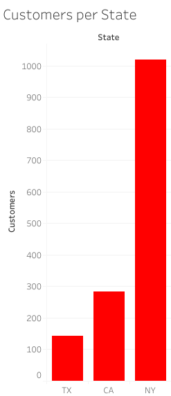

# Intorduction
The purpose of this analysis is to gain insights into sales, stocks, and staff performance of a bike store company with branches in New York, Texas and Carlifonia.

# Background
I acquired the data from (https://www.kaggle.com/datasets/dillonmyrick/bike-store-sample-database)

It contains 9 tables with the following fields:

1. **brands** - brand_id,
            brand_name

2. **categories** - category_id,
                category_name

3. **customers** - customer_id,
            	first_name,
                last_name,
                phone,
                email,
                street,
                city,
                state,
                zip_code

4. **order_items** - order_id,
            	item_id,
                product_id,
                quantity,
                list_price	discount

 5. **orders** - order_id,
           	customer_id,
            order_status,
            order_date,
            required_date,
            shipped_date,
            store_id,
            staff_id

6. **products** - product_id,
              product_name,
              brand_id,
              category_id,
              model_year,
              list_price

7. **staffs** - staff_id,	first_name,	last_name	,email,	phone,	active,	store_id,	manager_id

8. **stocks** - store_id,	product_id,	quantity


9. **stores** - store_id,	store_name,	phone,	email,	street	city,	state,	zip_code

### The questions and tasks I wanted to ask through my SQL queries were divided into 3 levels : beginner, intermediate and advanced levels. They are:
 
 #### Beginner Level Questions

 1. List all products with their names and list prices.

 2. Find all customers who live in every state.

3. Count how many products are in each category.

4. List all stores and their phone numbers

5. Show all orders placed in a specific date

6. Retrieve the total number of customers in the databse.

7. List product names along with their brand names.

#### Intermediate Level Questions

8. Get the total sales (sum of item prices * quantity) for each store.

9. List customers who have placed an order, along with their order IDs.

10. Find the top 5 most expensive products.

11. Show all products with their stock quantities in each sore.

12. Find the average list price of products per brand

13. List orders along with customers names and order dates.

14. Identify which products have not been ordered yet.

15. Show the total quantity sold for each product.

#### Advanced Level Questions

16. Get the top 10 best selling products.

17. Rank cutomers by their total spending.

18. Find the month with the highest sales.

19. Find the yearly sales.

20. Determine the staff member who has processed the most orders.


21. Calculate the reorder frequency of products by checking the gaps between order dates.
Use window function LAG()

22. Generate a report showing each stores total sales, number of orders and average order value.

23. Use a window function to to calculate runnig totals of sales per store.

24. Create a procedure to get total sales for a store.


# Tools I used
- **SQL** - Used to query the databse
- **PostgreSQL** - Database Mangement System (DBMS) used and to generate entity relationship diagram (ERD)
- **Visual Studio Code** - For database management and executing SQL queries
- **Git and Github** - For version control and ensuring collaborations
- **Tableau** - For data visualization (generation of graphs) and dashboarding.
                
# Data Modelling
This is establishing relationships between the different tables, assigning primary keys, foreign keys and generating entity relationship diagram. This was done using postgresql.


# Analysis
## Beginner Level Questions

### 1. List all products with their names and list prices.

```sql
SELECT product_name,
       list_price
FROM products;
```
###  2. Find all customers who live in every state.
```sql
SELECT COUNT(customer_id) AS customers,
       state
FROM customers
GROUP BY state
ORDER BY COUNT(customer_id) DESC;
```
I used COUNT( ) to find the total number of customers in the database and then grouped the customers by state.




#### Conclusion
New York has the most customers, followed by Carlifonia and then Texas.

### 3. Count how many products are in each category.
```sql
SELECT COUNT(product_id) AS total_products,
       products.category_id,
       categories.category_name
FROM products
LEFT JOIN categories ON products.category_id=categories.category_id
GROUP BY products.category_id, categories.category_name ;
```


#### Conclusion

Cruiser bikes are the highest in terms of total products available while Cycloros Bicycles are the least.

### 4. List all stores and their phone numbers
```sql
SELECT store_name,
       phone
FROM stores;
```


### 5. Show all orders placed in a specific date

```sql
SELECT *
FROM orders
WHERE order_date='2016-09-30';
```
I used the WHERE( ) clause to filter data for only order date '2016-09-30'

### 6. Retrieve the total number of customers in the databse.

```sql
SELECT COUNT(customer_id) AS total_customers
FROM customers;
```
I used the COUNT( ) clause to count customers' id's since each customer has a unique id.


#### Conclusion
There are 1445 customers in the customers table.

### 7. List product names along with their brand names.

```sql
SELECT product_name,
       brand_name
FROM products
LEFT JOIN brands ON products.brand_id=brands.brand_id;
```
The brand name of a product is contained in the brand table. I therefore joined the brand table to product tabel using brand_id to get the brand_name.

## Intermediate Level Questions
### 8. Get the total sales (sum of item prices * quantity) for each store.

```sql
SELECT ROUND(SUM(quantity * (list_price - discount))) AS total_sales,
       store_name
FROM order_items

LEFT JOIN orders ON order_items.order_id=orders.order_id
LEFT JOIN stores ON orders.store_id=stores.store_id

GROUP BY store_name;
```


#### Conclusion
Baldwin Bikes based in New York is the best performing store in terms of total orders processed, followed by Rowlett Bikes in Carlifonia and then Santa Cruz Bikes in Texas.


### 9. List customers who have placed an order, along with their order IDs.

```sql
SELECT orders.customer_id,
       first_name,
       last_name,
       order_id
FROM orders

LEFT JOIN customers ON orders.customer_id=customers.customer_id;
```
#### Conclusion
A total of 1615 customers have plcaed orders.
### 10. Find the top 5 most expensive products.

```sql
SELECT product_id,
       product_name,
       list_price
FROM products
ORDER BY list_price DESC
LIMIT 8;
```
I used the ORDER BY( ) clause to filter the list prices from highes to lowest (DESC), and then used LIMIT 8 to get the top 5 most expensive products. This is because there is a tie at 6499.99.


#### Conclusion
The most expensive product is the Trek Domane SLR 9 Disc - 2018 which ges for 11999.99.

### 11. Show all products with their stock quantities in each sore.
```sql
SELECT  stocks.product_id,
        product_name,
        quantity AS stock_quantity,
        store_name
FROM stocks
LEFT JOIN products ON stocks.product_id = products.product_id
LEFT JOIN stores ON stocks.store_id = stores.store_id;
```

### 12. Find the average list price of products per brand
```sql
SELECT brand_name,
       ROUND(AVG(list_price)) AS avg_list_price
FROM products
LEFT JOIN brands ON products.brand_id = brands.brand_id
GROUP BY 1;
```


#### Conclusion 
Trek is the most expensive brand, while Stider is the least expensive brand, meaning it is more affordable. A customer needs an average of $2500 to buy Trek products while one only needs an average of $210 to buy Strider products.

### 13. List orders along with customers names and order dates.
```sql
SELECT orders.order_id,
       orders.customer_id,
       first_name,
       last_name,
       order_date
FROM orders

LEFT JOIN customers ON orders.customer_id = customers. customer_id;

```

### 14. Identify which products have not been ordered yet.
```sql
SELECT products.product_id,
       product_name,
       order_items.order_id
FROM products

LEFT JOIN order_items ON products.product_id = order_items.product_id

WHERE order_id is NULL;
```
I joined the order_items table to the products table so as to filter out the products where order_id was null. NULL order_id means the product had not been ordered yet. 


#### Conclusion
There were a total of 14 unordered products.

### 15. Show the total quantity sold for each product.
```sql
SELECT order_items.product_id,
       product_name,
      SUM(quantity) AS total_quantity_sold
FROM order_items

LEFT JOIN products ON order_items.product_id = products.product_id
GROUP BY order_items.product_id,product_name
ORDER BY total_quantity_sold DESC;
```
These are the most sold products.

.png)

```sql
SELECT order_items.product_id,
       product_name,
      SUM(quantity) AS total_quantity_sold
FROM order_items

LEFT JOIN products ON order_items.product_id = products.product_id
GROUP BY order_items.product_id,product_name
ORDER BY total_quantity_sold ASC
LIMIT 10;
```
These are the least sold products.


## Advanced Level Question
### 16. Get the top 10 best selling products.
```sql
SELECT order_items.product_id,
       product_name,
       SUM(quantity) AS total_quantity_sold
FROM order_items
left JOIN products ON order_items.product_id = products.product_id
GROUP BY order_items.product_id, product_name
ORDER BY total_quantity_sold DESC
LIMIT 10;
```


### 17. Rank cutomers by their total spending.

```sql
SELECT order_items.order_id,
       first_name,
       last_name,
      SUM(quantity * (list_price - discount)) AS total_spent,

      RANK() OVER (ORDER BY   SUM(quantity * (list_price - discount)) DESC) AS rank

       
FROM order_items

LEFT JOIN orders ON order_items.order_id = orders.order_id
LEFT JOIN customers ON orders.customer_id = customers.customer_id
GROUP BY 1,2,3;
```
I used the RANK ( ) function and DESC to rank the customers from who spent the most to the least over the 3 year order period.


#### COnclusion
The most money spent by customers range from $3300 and $2000. 

### 18. Find the month with the highest sales.
```sql
SELECT EXTRACT(MONTH FROM order_date) AS order_month,
     ROUND(SUM (quantity * (list_price - discount) )) AS total_sales
FROM order_items

LEFT JOIN orders ON order_items.order_id = orders.order_id
GROUP BY order_month
ORDER BY total_sales DESC;
```
I used the EXTRACT ( ) method to get the month of each order. I then used ORDER BY ( ) to get the total sales from the highest to the lowest.


#### Conclusion
April had the most sales while September always had the lowest sales.

### 19. Find the yearly sales.

```sql
SELECT EXTRACT(YEAR FROM order_date) AS order_year,
       ROUND(SUM (quantity * list_price - discount)) AS total_sales
FROM order_items

LEFT JOIN orders ON order_items.order_id = orders.order_id
GROUP BY 1 ;

```


#### Conclusion
The sales improved in 2017 from 2016. They however declined sharply in 2018.

### 20. Determine the staff member who has processed the most orders.

```sql
SELECT COUNT(DISTINCT order_items.order_id )AS total_orders,
       orders.staff_id,
       first_name,
       last_name
FROM products

LEFT JOIN order_items ON products.product_id = order_items.product_id
LEFT JOIN orders ON order_items.order_id=orders.order_id
LEFT JOIN staffs ON orders.staff_id = staffs.staff_id

WHERE order_items.order_id IS NOT NULL
GROUP BY 2,3,4
ORDER BY total_orders DESC;

```


#### Conclusion
Marcelene Boyer is the best performing staff having processed 553 orders.

### 21. Calculate the reorder frequency of products by checking the gaps between order dates. Use window function LAG()

```sql
WITH product_orders AS(
    
    SELECT products.product_id,
           product_name,
           order_date,


        LAG(order_date) OVER(PARTITION BY products.product_id ORDER BY order_date) AS previous_order_date


    FROM products

LEFT JOIN order_items ON products.product_id = order_items.product_id
LEFT JOIN orders ON order_items.order_id = orders.order_id
WHERE order_date IS NOT NULL

)SELECT product_id,
        product_name,
       ROUND(AVG(order_date - previous_order_date),0 ) AS avg_gap_order_days
 FROM  product_orders
  WHERE previous_order_date IS NOT NULL
  GROUP BY 1,2
 ORDER BY avg_gap_order_days ASC;
 ```

### 22. Generate a report showing each stores total sales, number of orders and average order value.
```sql
SELECT orders.store_id,
     ROUND( SUM (quantity * (list_price - discount))) AS total_sales, 
     COUNT( DISTINCT oi.order_id) AS total_orders,
     store_name,
    ROUND(SUM (quantity * (list_price - discount)) /COUNT(DISTINCT oi.order_id)) AS avg_order_value
FROM order_items AS oi

LEFT JOIN orders ON oi.order_id = orders.order_id
LEFT JOIN stores ON orders.store_id = stores.store_id
GROUP BY 1,4;
```


#### Conclusion
Baldwin Bikes has the highest sales,  orders. This implies that it is the best performing store in terms of sales and orders. Rowlett Bikes has the highest average order value meaning that customers shop high priced products or shop multiple items in a single order more. 

### 23. Use a window function to to calculate runnig totals of sales per store.

```sql
SELECT s.store_name, o.order_date,
 SUM(oi.list_price * (oi.quantity - discount)) OVER (
 PARTITION BY s.store_name ORDER BY o.order_date
 ) AS running_total
FROM orders o
JOIN order_items oi ON o.order_id = oi.order_id
JOIN stores s ON o.store_id = s.store_id;
```
### 24. Create a procedure to get total sales for a store.

```sql
CREATE OR REPLACE PROCEDURE get_total_sales(p_store_id int)
LANGUAGE plpgsql
AS $$
DECLARE
v_total_sales NUMERIC;
v_store_name VARCHAR(20);


BEGIN
SELECT ROUND(SUM(quantity * (list_price - discount))) AS total_sales,
       store_name
       
    INTO
    v_total_sales,
    v_store_name
 FROM order_items
LEFT JOIN orders ON order_items.order_id=orders.order_id
LEFT JOIN stores ON orders.store_id=stores.store_id
WHERE orders.store_id = p_store_id

GROUP BY store_name;

RAISE NOTICE 'Total sales for store % (%): %', p_store_id, v_store_name, v_total_sales;

END;
$$;

CALL get_total_sales(2);
```
# Dashboard


# Lessons Learnt
I learnt how to visualize data and create dasboards in Tablaeu.


    